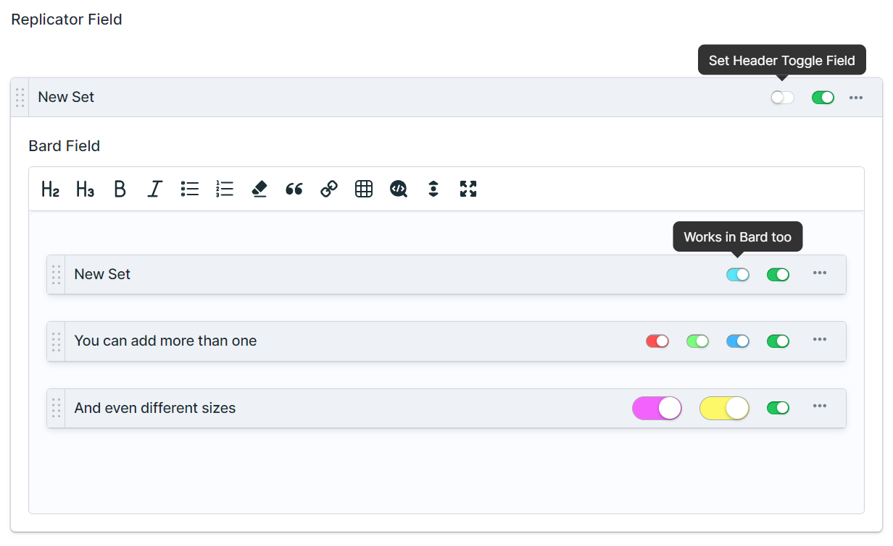
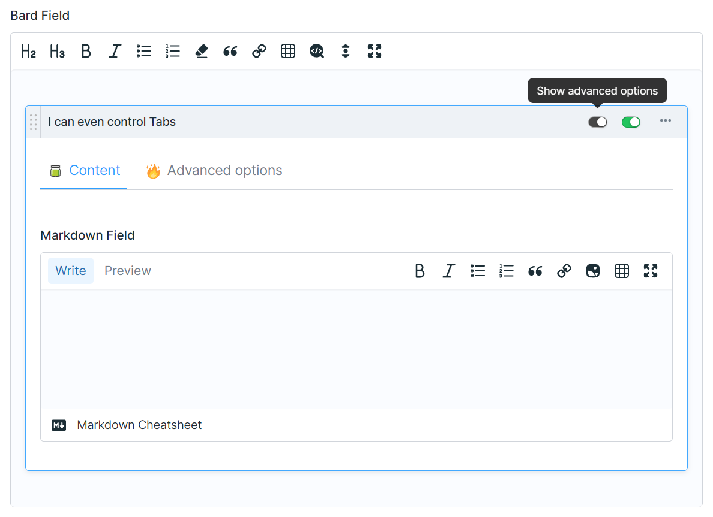

# Statamic Set Header Toggle

A Statamic plugin to add a "Set Header Toggle" Fieldtype. Add toggles to Replicator and Bard set headers.



## Installation

Install this plugin using composer.

```cli
composer require eminos/statamic-set-header-toggle
```

## Features

- Add tiny toggles to Replicator or Bard set headers.
- Set any color you want.
- Choose between two sizes.
- Add one or any number you want.
- Shows the field display label on hover.

## Usage

Just add the Set Header Toggle field inside any Replicator or Bard set. It will show up in the header of that set!

This can be useful to control some rarely used or advanced settings, or if you'd want to control the visibility of other fields.

Here is an example of a Set Header Toggle controlling the visibility of a Tab. Tabs can be added with the [Statamic Tabs](https://github.com/eminos/statamic-tabs) addon.



## Possible improvements

- Optionally group multiple toggles in a dropdown.
- Tiny labels.

## License

The MIT License (MIT). Please see [License File](LICENSE.md) for more information.